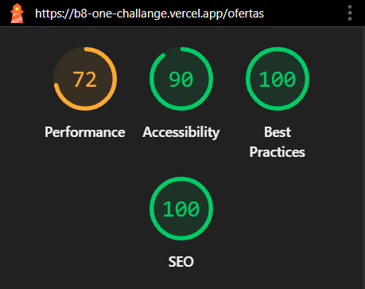
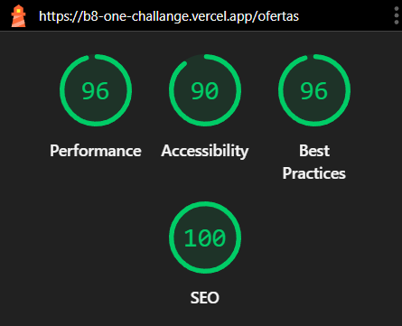

# Desafio da B8ONE

## 📋 Sobre o Projeto

Este projeto foi desenvolvido como um exercício prático para simular
uma vitrine de produtos online.

## 📋 Link do projeto hospedado na vercel

https://b8-one-challange.vercel.app/

## 💡 Resultados do lighthouse

### Mobile



### Desktop



## 🚀 Tecnologias Utilizadas

- [React](https://reactjs.org/) - Biblioteca para interfaces de usuário
- [Next.js](https://nextjs.org/) - Framework React para produção
- [Tailwind CSS](https://tailwindcss.com/) - Framework CSS para estilização
- [TypeScript](https://www.typescriptlang.org/) - Superset JavaScript com tipagem

## 🔧 Pré-requisitos

Antes de começar, você vai precisar ter instalado em sua máquina:

- [Node.js](https://nodejs.org/en/) (versão 18 ou superior)
- [npm](https://www.npmjs.com/) ou [yarn](https://yarnpkg.com/)
- [Git](https://git-scm.com/)

## 🎯 Instalação e Execução

### Clonando o repositório

```bash
git clone https://github.com/seu-usuario/nome-do-projeto.git
cd nome-do-projeto
```

### Instalando dependências

```bash
# Com npm
npm install

# Com yarn
yarn install
```

### Executando o projeto

```bash
# Com npm
npm run dev

# Com yarn
yarn dev
```

## 📁 Estrutura do Projeto

```
src/
├──── app/
│     ├── page.tsx          # Página principal
│     └── layout.tsx        # Layout base
├──── components/
│     └── Header.tsx        # Componente do cabeçalho
│     └── Footer.tsx        # Componente do rodapé
│     └── Pagination.tsx          # Componente de Paginação
│     └── Skeleton.tsx            # Componente de skeleton para loading da lista de produtos
├──── ofertas/
│       └── page.tsx        # Página de ofertas
├──────── components/
│         └── ViewModeToggle.tsx      # Componente dos botões do tipo de visualização para os produtos
├────────── Filters/
│           └── Filter.tsx              # Componente de Filtro
│           └── ResultsSummary.tsx      # Componente responsável por mostrar a quantidade de produtos
├────────── Product/
│           └── ProductCardGrid.tsx     # Componente de produtos em grid
│           └── ProductCardList.tsx     # Componente de produtos em lista
│           └── ProductDisplay.tsx      # Componente para renderização dos produtos
│           └── ProductList.tsx         # Componente de listagem produtos
├──── styles/
│     └── globals.css       # Estilos globais
└── ...
```

## 🛠️ Scripts Disponíveis

- `npm run dev` - Executa o projeto em modo de desenvolvimento
- `npm run build` - Cria a build de produção
- `npm run start` - Executa a build de produção
- `npm run lint` - Executa o linter do código

## ✨ Funcionalidades

- [x] Filtros
- [x] Página responsiva
- [x] Integração com API
- [x] Paginação de produtos
- [x] Skeleton na renderização de produtos
- [x] Visualização dos produtos em Lista e em Grid

## 👤 Autor

**Fábio Filho**

- GitHub: [@Fabiopmfilho](https://github.com/Fabiopmfilho)
- LinkedIn: [fabiopm-filho](https://www.linkedin.com/in/fabiopm-filho/)
